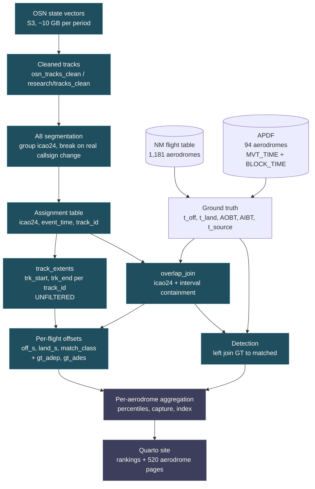

# ADS-B airport coverage from track boundary error — design

**Date:** 2026-08-27
**Repo:** `euctrl-pru/opensky-airport-coverage`
**Status:** approved design, pending implementation plan

## The question

OPDI builds flight tracks from OpenSky ADS-B state vectors. The
track-construction V1 study measured **boundary error** — the signed distance
from a track's true first and last sample to the flight's actual take-off and
landing times — but reported it only as three percentiles over all of Europe.

Boundary error is, read per aerodrome, a **coverage** measurement. A track that
begins fifteen minutes before wheels-off means a receiver saw the aircraft push
back and taxi. A track that begins thirty seconds *after* wheels-off means
nothing on the ground was heard at all. Aggregated to one number over 95,000
flights, that distinction disappears; split by aerodrome, it is a map of where
OpenSky's ground reception is good and where it is not.

This study produces that map, publishes it as a static site, and ranks
aerodromes on it.

## Decisions taken

| Decision | Choice | Why |
|---|---|---|
| Ground-truth population | Two tiers | APDF measures all four milestones but covers 94 aerodromes; NM covers 1,181 but has no in-block time |
| Ranking basis | Coverage Index = detection × ground capture | Raw seconds rank taxi duration, not coverage |
| Segmentation | A8 `recommended` | Legacy fragments 42% of tracks on blank callsigns; that artefact would be read as poor reception |
| Toolchain | Python, offline render from a committed extract | GitHub Actions must rebuild Pages with no cluster credentials |
| Sample | 2025-06-05/07 and 2024-06-05/07 | The only days for which cleaned tracks exist; two periods so a finding can be checked twice |
| `opdi` dependency | Merge `track-construction-v1` into `opdi` main first | One definition of A8 and of ground truth, not a vendored fork |

## Prerequisite: merging `track-construction-v1` into `opdi` main

The A8 segmentation, `benchmarks/track_truth.py` and `benchmarks/track_score.py`
exist only on the `track-construction-v1` branch of the `opdi` submodule. This
study depends on all three, and vendoring a copy would fork exactly the
definitions that `boundary_offsets` was extracted to keep single.

The branch is 49 commits ahead of main and 30 behind, with one content conflict
(`src/opdi/pipeline/flights.py`).

**Merge direction:** merge `main` into the branch first, inside the existing
`opdi/.claude/worktrees/track-construction-v1` worktree, resolve the conflict
there where the V1 tests can verify the resolution, run the full suite, and only
then bring the result onto main. The branch is deleted afterwards.

**Scope: the full branch, including the default flip.** A8 becomes the
pipeline's default segmentation and `_add_track_id` becomes a versioned choice
rather than a frozen rule. This is the change V1 recommends, in the order V1
recommends it — the `flights.py` callsign-labelling fix is on the same branch
and lands with it.

**Consequence, recorded because it is not reversible by a later commit:**
`track_id` changes shape for every flight published from the next production run
forward. A8 carries no `_{year}_{month}` suffix, so identifiers become
`{hash}_{offset}`, and any consumer parsing the suffix breaks in a way a pure
value change would not. Past months will not reproduce. This was raised as a
release decision and approved as such on 2026-08-27; it is not a side effect of
building this site.

## Ground truth: two tiers

`track_truth.load_flight_intervals` already labels every flight with `t_source`.
This study reads that label as a tier rather than a filter, which is the
widening `track_score.boundary_error`'s docstring records as open. It is opened
here deliberately and only for the airborne metrics.

**Tier A — `t_source == "apdf"`, 94 aerodromes.** All four milestones are
measured: AOBT and AIBT from APDF `BLOCK_TIME_UTC`, ATOT and ALDT from
`MVT_TIME_UTC`. Every one of the 94 has at least 20 departures in a three-day
window and 84 have at least 200, so per-aerodrome percentiles are meaningful.
Ground-capture metrics exist only here, because AIBT exists nowhere else.

**Tier B — `t_source == "nm_inferred"`, ~430 aerodromes at N ≥ 20.** An
aerodrome qualifies when `max(n_dep, n_arr) >= 20` in at least one period; each
side's statistics are suppressed independently when that side alone falls below
20, rather than dropping the aerodrome. The threshold is stated once here and
referenced, never re-chosen per table. Take-off is
`AOBT_3 + TAXI_TIME_3` and landing is `ARVT_3`, validated in V1 Task 4 at median
error 0 s with IQR 17 s and 25 s. Airborne boundary error and detection rate
only; no capture fractions.

The two tiers are ranked in separate tables and never interleaved. A Tier B page
states its provenance in its header, not in a footnote.

### Extending `load_apdf_times`

`load_apdf_times` currently selects `MVT_TIME_UTC` alone. It gains
`BLOCK_TIME_UTC` — AOBT on the `SRC_PHASE == 'DEP'` rows, AIBT on the `'ARR'`
rows — which is already present in the committed `reference/apdf_*.parquet`
extracts at 0.02% null. No new Oracle extraction is required, and the change is
additive: existing callers select the columns they already used.

## Metrics

Departures are grouped by `gt_adep`, arrivals by `gt_ades`. Both sides appear on
every aerodrome page; an aerodrome can have good arrival coverage and poor
departure coverage, and that asymmetry is itself a finding.

### Detection — both tiers

`overlap_join` is an inner join, so a ground-truth flight that OpenSky never saw
does not appear in `matched` at all and is invisible to every V1 metric. Left-
joining matched flights back onto the full ground-truth table recovers it.

- `n_gt` — ground-truth movements at this aerodrome in the sample
- `n_detected` — those with at least one assigned state vector
- `detection_pct` — the ratio

**Restriction:** detection is reported only for aerodromes inside the ingestion
bounding box (`osn_sample.BBOX`, −25.87/26.75 to 49.66/70.26). A non-European
ADEP appears in the NM flight table but its departure was never ingested, so its
detection rate would read as zero coverage when it is really out of scope.
Out-of-bbox aerodromes are excluded from both ranking tables and get no page.

### Signed boundary error — both tiers

Per flight, from `track_score.boundary_offsets` with `gt_adep`/`gt_ades` carried
through: `off_s = trk_start − ATOT` and `land_s = trk_end − ALDT`. Negative
`off_s` means the track starts before take-off, which is the good case.

Reported per aerodrome at p10, p25, p50, p75 and p90, plus the absolute p50 and
p90 so the numbers stay comparable with V1's published table.

### Ground capture — Tier A only

Raw seconds are not comparable across aerodromes. A median `off_s` of −180 s is
complete coverage at a regional field with a three-minute taxi and roughly 15%
of the taxi at a hub with a twenty-minute one. Normalising by the aerodrome's
own ground phase removes that.

```
dep_capture = clip((ATOT − trk_start) / (ATOT − AOBT), 0, 1)
arr_capture = clip((trk_end  − ALDT) / (AIBT  − ALDT), 0, 1)
```

- `dep_capture_p10/p50/p90`, `arr_capture_p10/p50/p90`
- `dep_no_ground_pct` — share of departures with `trk_start ≥ ATOT`, never heard
  on the ground
- `dep_full_capture_pct` — share at capture ≥ 0.95
- `taxi_out_median_s`, `taxi_in_median_s` — context, because they are what makes
  raw seconds incomparable

**Denominator guard.** Flights with `AOBT ≥ ATOT` or `AIBT ≤ ALDT` have a
non-positive ground phase. That is bad reference data, not zero coverage, so
they are excluded from the capture statistics and counted in
`n_capture_excluded`, which is shown on the page. Clipping without excluding
them would silently score them 0 or 1.

### Segmentation quality — both tiers

`clean_pct`, `fragmented_pct`, `merged_pct` per aerodrome, from the same
three-way classification `track_score.match_rates` uses. Present so a poor
coverage number can be attributed to reception or to the algorithm rather than
guessed at.

## Ranking

```
coverage_index = detection_rate × (0.5 · dep_capture_p50 + 0.5 · arr_capture_p50)
```

Read as the expected fraction of a movement actually captured: the chance the
flight is seen at all, times how much of its ground phase is seen when it is.
The formula appears in `metrics.qmd`, not only in code, and every
component is a visible column so a reader can re-rank on whichever term they
care about.

Tier B has no capture term and ranks on `detection_pct` alone, in its own table.
There is no combined leaderboard, because the two tiers do not measure the same
thing.

Both periods are ranked side by side. An aerodrome whose index moves sharply
between 2024 and 2025 is a different finding from one that is consistently low,
and a single-period table cannot show that.

## Architecture

The expensive half runs on the cluster and writes a small table. The site
renders from that table with no credentials, which is what lets GitHub Actions
rebuild Pages on every push.

```
                   OSN state vectors (S3, ~10 GB/period)
                              │
                    scripts/run_offsets.py          ← cluster, Spark on K8s
                    A8 assignment → extents → GT join
                              │
              data/flight_offsets_{2025,2024}.parquet   ← committed, ~MB
                              │
                    scripts/aggregate.py            ← laptop, pandas
                              │
              data/airport_stats_{2025,2024}.csv    ← committed
              data/_manifest.json                   ← provenance
                              │
                    site/  (Quarto, Python)         ← offline, no credentials
                              │
                    GitHub Actions → Pages
```

### `scripts/run_offsets.py` — the cluster job

Per period: read cleaned tracks for the sample days, apply the A8 rule via
`opdi.pipeline.segmentation.assign_track_id`, write the assignment table, read
it back, compute `track_extents` over the *full* table, `overlap_join` to ground
truth, compute per-flight offsets with aerodrome keys and block times attached,
left-join to full ground truth for detection, write the result, delete the
assignment table.

Two constraints inherited from `track_methods.py`, both load-bearing:

- **Extents come from the unfiltered assignment table, never from `matched`.**
  `overlap_join` clips every row to `[t_off, t_land]`, so extents derived from
  it can only land inside the interval — the error becomes one-sided and a
  merged track scores near zero. This is documented at length in
  `boundary_error` and must not be re-derived.
- **The assignment table is deleted before the next period.** The bucket was at
  96.89 GB of a ~100 GB quota on 2026-08-23. One assignment table is ~0.31 GB;
  peak footprint is one, not two. Deletion runs on the failure path as well as
  the success path, and every key is checked against this run's own prefix
  before deletion.

Output is one row per ground-truth flight: `flight_key`, `period`, `gt_adep`,
`gt_ades`, `t_source`, `icao24`, `t_off`, `t_land`, `aobt`, `aibt`, `trk_start`,
`trk_end`, `off_s`, `land_s`, `match_class`. Roughly 190,000 rows across both
periods — a few MB, small enough to commit and to re-aggregate on a laptop
without touching the cluster.

### `scripts/aggregate.py` — per-aerodrome statistics

A thin entrypoint over `src/oac/aggregate.py`; the logic lives in the module
and the script only parses arguments and writes the CSVs. Pure pandas over the
committed per-flight table. No Spark, no credentials, runs
in seconds. This is the separation that matters: changing a percentile, adding a
metric or re-cutting the tiers is a laptop edit, not a two-hour cluster run.

### `src/oac/` — the library

- `truth.py` — the `BLOCK_TIME_UTC` extension to `load_apdf_times`, and the
  bbox filter for aerodromes
- `offsets.py` — per-flight offsets with aerodrome keys, extending
  `track_score.boundary_offsets` rather than reimplementing it
- `aggregate.py` — the per-aerodrome statistics and the Coverage Index
- `provenance.py` — the stamping described below

Everything is imported from `opdi` where `opdi` already has it. This repo adds
the per-aerodrome cut and the site; it does not re-own ground truth.

### Provenance

`benchmarks/provenance.py`'s pattern is carried over: every committed output is
stamped with the script, argv, git SHA of both repos, dirty flag, and a
fingerprint over the source files it depends on, written to
`data/_manifest.json`. An output with no manifest entry is rendered as
**unverified** on the page rather than shown as fact.

This matters more here than in the portal papers, because the site renders
offline by design. Offline rendering is exactly the condition under which a
stale CSV renders cleanly and says nothing about being stale.

## The site

**Numbers first.** Every page is tables and distributions. Prose exists only to
define a column or to state a caveat that would otherwise make a number
misread. No narrative sections, no restatement of what a chart already shows.

- `index.qmd` — the two ranking tables
- `pipeline.qmd` — how a number is produced, as a mermaid diagram plus a stage table
- `metrics.qmd` — the data dictionary: every column, its formula, its units, its
  domain, and what a high and low value mean
- `airports/<ICAO>.qmd` — one page per aerodrome
- `about.qmd` — sample definition, provenance table, regeneration commands

### `pipeline.qmd` — how a number is produced

A reader who distrusts a ranking needs to see what produced it. This page is the
provenance chain from raw state vector to published column, as one mermaid
diagram and one stage table. No prose beyond what a stage's row needs.

The diagram is a native Quarto ```` ```{mermaid} ```` block — rendered by
Quarto's bundled mermaid, so it needs no external library and survives the
offline render and the Actions build.



Two things the diagram is drawn to make unmissable, because both are silent
failure modes rather than errors:

- `EXT` is fed from `ASG` directly and **not** through `OJ`. `overlap_join`
  clips every row to `[t_off, t_land]`, so extents taken after it can only land
  inside the interval — boundary error becomes one-sided and a merged track
  scores near zero.
- `DET` needs `GT` as well as `OJ`, because a flight that was never seen exists
  only on the ground-truth side.

The stage table beside it gives, per stage: the module and function, where it
runs (cluster or local), its input and output row counts for both periods, and
the committed artefact it produces if any. Counts are read from
`data/_manifest.json`, so the page cannot claim a row count the run did not
produce.

### `metrics.qmd` — the data dictionary

One row per column that appears anywhere on the site. This page is the reason
the others need no explanatory prose: a column name on any table links here.

| Column | Formula | Unit | Domain | Reading |
|---|---|---|---|---|
| `n_gt` | count of ground-truth movements | flights | ≥ 0 | sample size; every other column is unreliable when this is small |
| `n_detected` | ground-truth flights with ≥ 1 assigned state vector | flights | `0..n_gt` | |
| `detection_pct` | `100 · n_detected / n_gt` | % | `0..100` | 100 = every movement seen at least once |
| `off_s` | `trk_start − ATOT` | s | signed | **negative is good** — track began before wheels-off |
| `land_s` | `trk_end − ALDT` | s | signed | **positive is good** — track ran on past touchdown |
| `off_s_p10 … p90` | percentiles of `off_s` over the aerodrome's departures | s | signed | p90 is the worst-covered decile |
| `land_s_p10 … p90` | percentiles of `land_s` | s | signed | p10 is the worst-covered decile |
| `off_abs_p50`, `off_abs_p90` | percentiles of `|off_s|` | s | ≥ 0 | V1 comparability only; do not read as coverage |
| `dep_capture` | `clip((ATOT − trk_start) / (ATOT − AOBT), 0, 1)` | fraction | `0..1` | share of taxi-out seen. Tier A only |
| `arr_capture` | `clip((trk_end − ALDT) / (AIBT − ALDT), 0, 1)` | fraction | `0..1` | share of taxi-in seen. Tier A only |
| `dep_no_ground_pct` | `100 · #(trk_start ≥ ATOT) / n_detected` | % | `0..100` | share never heard on the ground |
| `dep_full_capture_pct` | `100 · #(dep_capture ≥ 0.95) / n_detected` | % | `0..100` | share whose whole taxi-out was seen |
| `taxi_out_median_s` | median `ATOT − AOBT` | s | > 0 | context: why raw seconds differ between aerodromes |
| `taxi_in_median_s` | median `AIBT − ALDT` | s | > 0 | context |
| `n_capture_excluded` | count of `AOBT ≥ ATOT` or `AIBT ≤ ALDT` | flights | ≥ 0 | bad reference data, excluded from capture |
| `clean_pct` | `100 · #(1 flight ↔ 1 track) / n_gt` | % | `0..100` | |
| `fragmented_pct` | `100 · #(1 flight → many tracks) / n_gt` | % | `0..100` | |
| `merged_pct` | `100 · #(many flights → 1 track) / n_gt` | % | `0..100` | worse than fragmentation; unrecoverable downstream |
| `coverage_index` | `detection_rate · (0.5 · dep_capture_p50 + 0.5 · arr_capture_p50)` | fraction | `0..1` | expected share of a movement captured |

The same table states the two sign conventions once, since they are the single
most likely thing to be misread: `off_s` is good when negative, `land_s` is good
when positive.

### `index.qmd` — ranking tables

Two tables, never interleaved.

**Tier A** (94 aerodromes, all milestones measured), sorted by `coverage_index`
descending, 2025: `rank`, `icao`, `name`, `n_gt`, `detection_pct`,
`dep_capture_p50`, `arr_capture_p50`, `coverage_index`, `coverage_index_2024`,
`Δ index`, `dep_no_ground_pct`, `merged_pct`.

**Tier B** (~430 aerodromes, N ≥ 20, NM-inferred), sorted by `detection_pct`
descending: `rank`, `icao`, `name`, `n_gt`, `detection_pct`, `off_s_p50`,
`land_s_p50`, `off_s_p90`, `land_s_p10`, `fragmented_pct`.

Both sortable and filterable client-side, both with every component column
visible so a reader can re-rank without the Index. Each ICAO links to its page;
each column header links to its `metrics.qmd` row.

Above the tables: the fleet-level distribution of `coverage_index` and of
`detection_pct`, so a reader can see whether the ranking is a smooth gradient or
a small tail of bad aerodromes — and summary numbers (median, IQR, count above
and below thresholds) rather than a description of them.

### `airports/<ICAO>.qmd` — per aerodrome

Header line: ICAO, name, tier, `n_gt` per period, `coverage_index` and rank per
period.

**Distributions**, both periods overlaid on every chart:

- histogram of signed `off_s`, zero marked, x clipped at ±1800 s with the
  overflow counted in the caption
- histogram of signed `land_s`, same treatment
- ECDF of `dep_capture` and `arr_capture` (Tier A), with the fleet-median ECDF
  drawn behind as a reference line
- `off_s` p50 by hour of day, which is where a receiver outage or a
  night-movement effect shows up and a single median hides it

**Tables:**

- full percentile table — p10/p25/p50/p75/p90 of `off_s`, `land_s`,
  `dep_capture`, `arr_capture`, per period, with the 2024→2025 delta
- this aerodrome's value, the fleet median, and its percentile rank within its
  tier, for every ranking column — so "200 s" is immediately legible as good or
  bad here
- segmentation quality: `clean_pct`, `fragmented_pct`, `merged_pct` per period
- counts: `n_gt`, `n_detected`, `n_capture_excluded` per period

Charts follow the `dataviz` skill's palette and are theme-neutral. Pages are
generated from the aggregated CSV by a script, not written by hand — about 520
of them.

### Publishing

`.github/workflows/pages.yml` installs Quarto and Python, renders `site/`, and
deploys to Pages. No secrets, no cluster. Enabling Pages (Settings → Pages →
source: GitHub Actions) needs repo admin and is done by hand.

## Phases

The work decomposes into three, each independently verifiable:

1. **Merge** `track-construction-v1` into `opdi` main, full suite green, branch
   deleted. Nothing in this repo depends on anything until this lands.
2. **Analysis** — the `opdi` extensions, `src/oac/`, the cluster job, the
   aggregation, tests, and the committed extracts with provenance.
3. **Site** — Quarto pages, generator, workflow, Pages.

Phase 2 is the only one needing the cluster. Phase 3 needs neither cluster nor
credentials by design.

## Testing

- `truth.py`: block times are attached to the right `SRC_PHASE` rows, and the
  bbox filter excludes a known out-of-bbox aerodrome
- `offsets.py`: the sign convention holds — a fixture track starting before
  take-off yields negative `off_s`; a merged track yields a large error rather
  than none, which is the regression `track_score`'s own fixture guards
- `aggregate.py`: the denominator guard excludes non-positive ground phases
  rather than clipping them; capture is bounded to [0, 1]; the Index is
  reproduced by hand on a small fixture
- the page generator emits one page per aerodrome above the N threshold and none
  below it

Tests use a local Spark session as `opdi`'s `conftest.py` does, so they run
without a cluster.

## Limitations, stated up front

- **Six days total.** Cleaned tracks exist for 2025-06-05/07 and 2024-06-05/07
  and nowhere else, and at ~10 GB per period against ~3 GB of bucket headroom a
  longer sample cannot be built. Tier A aerodromes have adequate N; the Tier B
  tail does not, and is cut at N ≥ 20 for that reason.
- **June only.** Nothing here says anything about winter reception.
- **A8 is not the published segmentation** at the time of writing. It becomes
  the default with the merge this study depends on, but every dataset OPDI has
  published to date used the legacy rule, so these numbers do not describe
  downloadable OPDI data.
- **Coverage is receiver coverage as OPDI ingests it** — after the Europe bbox
  filter and 5 s decimation. It is not a statement about OpenSky's raw feed.
- **Tier B take-off times are inferred**, at a measured median error of 0 s but
  with a tail that is not characterised per aerodrome.

## Open logistics

The `opensky-airport-coverage` repo is empty and its default branch is `main`.
Pages built by Actions must run from the default branch, so the initial content
has to reach `main`. Work proceeds on a feature branch; how it lands on `main`
is confirmed before pushing.
